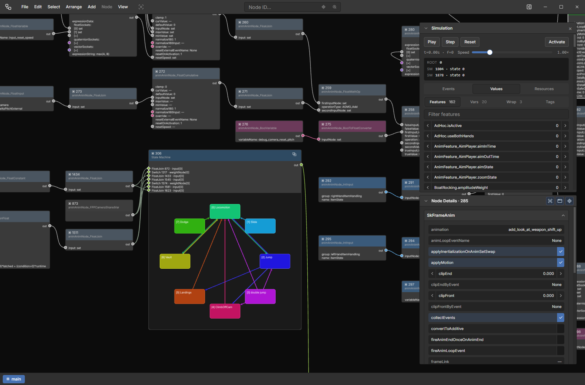

# Animgraph Editor

Desktop / web tool for inspecting and editing **Cyberpunk 2077** animation graphs (animgraphs) as an interactive node diagram.



## Features

- Open raw animgraph JSON, editor project files
- Hierarchical graph view with pan / zoom, nested scopes, and State Machine overview
- Edit layout (move, resize, arrange), connections, and node data
- Offline simulation of State Machines, transitions, and conditions
- Sim clips from WolvenKit `.anims.json` (resolve SkAnim names, durations, events)
- Anim databases from WolvenKit C2dArray `.csv.json` (`animAnimNode_AnimDatabase` lookups)
- Save / export with round-trip back to animgraph JSON

## Quick start

```bash
npm install
npm run dev
```

Open [http://127.0.0.1:5001](http://127.0.0.1:5001).

**Desktop (Electron):**

```bash
npm run dev:electron
```

**Production build (Windows Electron dir):**

```bash
npm run electron:build
```

## License

[GPL-3.0](https://www.gnu.org/licenses/gpl-3.0.html) · [TorDalor](https://github.com/Oxion)